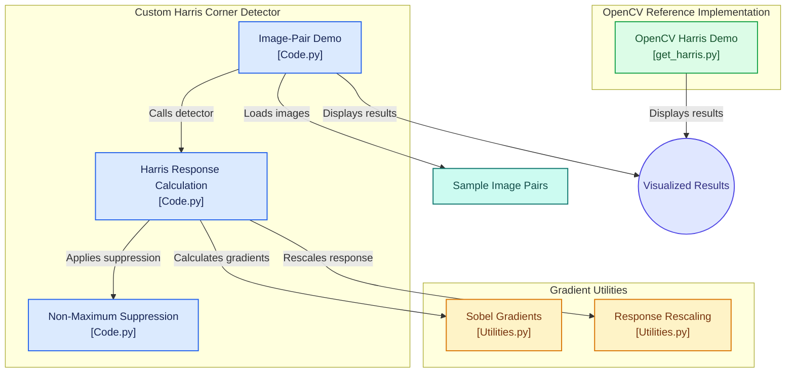

# Computer vision 
### Edge detection

## Harris Corner Detection Workflow

```mermaid id="w4k9zt"
flowchart TD
    subgraph group_custom["Custom Harris Corner Detector"]
        node_runner["Image-Pair Demo<br/>[Code.py]"]
        node_detector["Harris Response Calculation<br/>[Code.py]"]
        node_suppression["Non-Maximum Suppression<br/>[Code.py]"]
    end

    subgraph group_support["Gradient Utilities"]
        node_gradient["Sobel Gradients<br/>[Utilities.py]"]
        node_scaling["Response Rescaling<br/>[Utilities.py]"]
    end

    subgraph group_reference["OpenCV Reference Implementation"]
        node_opencv["OpenCV Harris Demo<br/>[get_harris.py]"]
    end

    node_sample["Sample Image Pairs"]
    node_display(("Visualized Results"))

    node_runner -->|"Loads images"| node_sample
    node_runner -->|"Calls detector"| node_detector
    node_detector -->|"Calculates gradients"| node_gradient
    node_detector -->|"Rescales response"| node_scaling
    node_detector -->|"Applies suppression"| node_suppression
    node_runner -->|"Displays results"| node_display
    node_opencv -->|"Displays results"| node_display

    click node_runner "https://github.com/yassakamille/computer_vision-edge_detection/blob/main/Harris/Code.py"
    click node_detector "https://github.com/yassakamille/computer_vision-edge_detection/blob/main/Harris/Code.py"
    click node_suppression "https://github.com/yassakamille/computer_vision-edge_detection/blob/main/Harris/Code.py"
    click node_gradient "https://github.com/yassakamille/computer_vision-edge_detection/blob/main/Harris/Utilities.py"
    click node_scaling "https://github.com/yassakamille/computer_vision-edge_detection/blob/main/Harris/Utilities.py"
    click node_sample "https://github.com/yassakamille/computer_vision-edge_detection/tree/main/Harris/input"
    click node_opencv "https://github.com/yassakamille/computer_vision-edge_detection/blob/main/Harris/get_harris.py"

    classDef toneNeutral fill:#f8fafc,stroke:#334155,stroke-width:1.5px,color:#0f172a
    classDef toneBlue fill:#dbeafe,stroke:#2563eb,stroke-width:1.5px,color:#172554
    classDef toneAmber fill:#fef3c7,stroke:#d97706,stroke-width:1.5px,color:#78350f
    classDef toneMint fill:#dcfce7,stroke:#16a34a,stroke-width:1.5px,color:#14532d
    classDef toneRose fill:#ffe4e6,stroke:#e11d48,stroke-width:1.5px,color:#881337
    classDef toneIndigo fill:#e0e7ff,stroke:#4f46e5,stroke-width:1.5px,color:#312e81
    classDef toneTeal fill:#ccfbf1,stroke:#0f766e,stroke-width:1.5px,color:#134e4a

    class node_runner,node_detector,node_suppression toneBlue
    class node_gradient,node_scaling toneAmber
    class node_opencv toneMint
    class node_sample toneTeal
    class node_display toneIndigo
```

